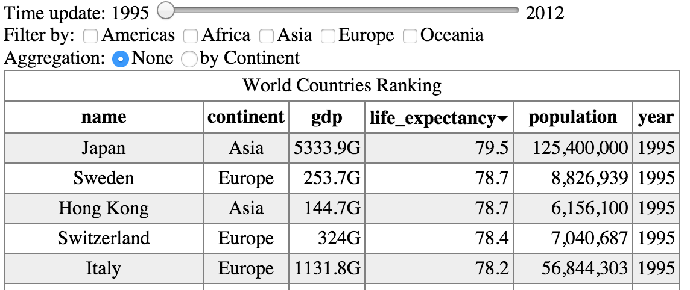
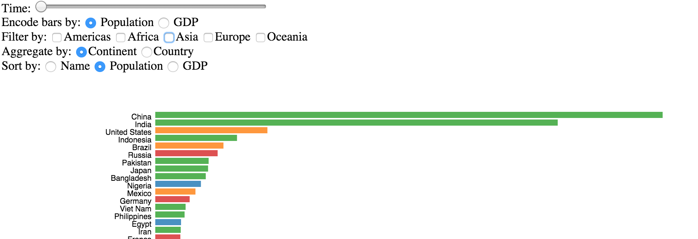
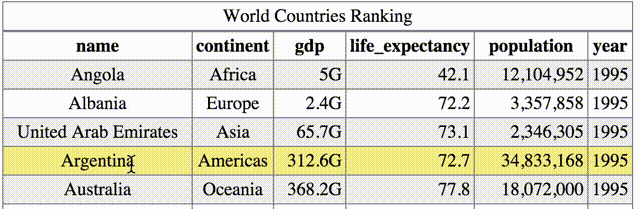
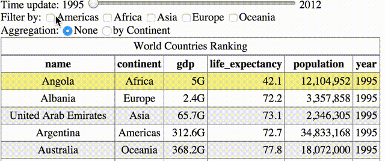
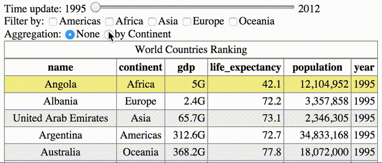
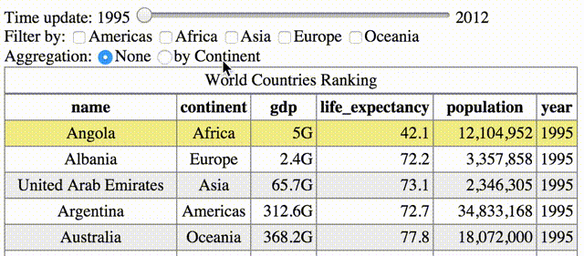
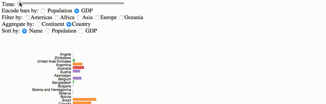

Homework 1
===
*This homework is due on Friday, February 13th 2015 11:59 pm*

In this homework, you will use [D3](http://d3js.org/) to create interactive and visual rankings of countries. First, you will build an interactive HTML data table to visualize, order, aggregate, and filter countries by name, population, or GDP, for one or multiple years. Your result will look like this.
 
<p align="center">
	
</p>

 Then, you will use SVG to encode country properties into a horizontal bar chart, for a result like that:
<p align="center">
	
</p>

This homework is designed to help you gain fundamental skills in HTML, JavaScript, and D3, and to gain insights into a relatively small dataset. Successfully completed, you will be able to:

1. Handle basic data operations such as loading, filtering, and aggregating data using D3.
2. Display data as an HTML table and connect user interface (UI) elements (sliders, radio buttons, and check-boxes) to interact with this table.
3. Create an SVG bar chart that uses similar interaction techniques as the HTML table but includes interactive transitions to react to updates.
4. Eventually learn more about world's countries using those rankings.

If you decide to address the [bonus question](#6---bonus-animated-transitions) you will learn how to create more sophisticated animated transitions for updating the bar chart.

## Prerequisites

* This homework assumes that you have read and coded along with Chapters 1-8 in [D3 - Interactive Data Visualization for the Web](http://www.amazon.com/Interactive-Data-Visualization-Scott-Murray/dp/1449339735/ref=tmm_pap_title_0) by Scott Murray. See the [course syllabus](http://www.cs171.org/2015/syllabus/#required-textbooks) for access to free online copies. Some of this material is covered briefly in Homework 0 and Section 1, but the book has more detail. *You may find it hard to approach D3's syntax and semantics without this introduction!*

* You should know how to use the HTML `<table>` element. See the MDN [developer guide](https://developer.mozilla.org/en-US/docs/Web/Guide/CSS/Getting_started/Tables) and [reference](https://developer.mozilla.org/en-US/docs/Web/HTML/Element/table) on the topic. We expect your answer to contain valid, [W3C ](http://www.w3.org/TR/html5/tabular-data.html#the-table-element) standard-compliant HTML 5.

* You should know a little JavaScript. Refer to the [JavaScript reference](https://developer.mozilla.org/en-US/docs/Web/JavaScript/Reference). In your answers, we expect no JavaScript error or warning. We will be using the latest version of Google Chrome (version 39) to test your homework. You can [check compatibility](http://caniuse.com/) with other versions and browsers.

* You may solve the coding problems using either D3 or pure JavaScript, except when we explicitly ask you to use a D3 function. You may not use other libraries (e.g., no jQuery, underscore).

## Instructions

Ensure you respond to questions in the appropriate text file (as described in the subheading for each section). You should use [Markdown](https://en.wikipedia.org/wiki/Markdown) to format your answers.

Follow the instructions given in [Section 1](https://github.com/CS171/2015-section1) to clone the repository.

Answer the written questions in a file called [answers.md](answers.md). Precede each answer with the question number. Be brief and to the point, don't write overly long answers. 

For questions 1 to 4, create and write your code in the file `table.html`, and question 5 and 6 in the `barchart.html` file.

## 1 - Improving the table presentation

The goal of this question is to load the countries dataset into a table, to improve the presentation by reducing the number of columns, and to add some interactivity.

### Dataset

We provide a copy of the dataset [data/countries_2012.json](data/countries_2012.json) from the [World Bank](http://data.worldbank.org/data-catalog/world-development-indicators) which contains demographic and economic indicators for 119 countries for the year 2012. Each entry represents a country; attributes describe the country: continent, sub-continent, and area. Here is a sample of the data for Afghanistan:

```json
{
	    "alpha2_code": "AF",
	    "continent": "Asia",
	    "gdp": 12430000000,
	    "latitude": 34.5228,
	    "longitude": 69.1761,
	    "name": "Afghanistan",
	    "population": 29824536,
	    "total_export_value": 441620129.756,
	    "total_import_value": 7293351961,
	    "year": 2012
}
```

The dataset is formatted using the human readable [JSON](http://en.wikipedia.org/wiki/JSON) file format. Rendering this data as a table will make it easier for us to read the data. Tables organize data linearly such as in [this GIST](http://bl.ocks.org/romsson/459be89d92ca8bac4f82). Basic interactivity (e.g., click on headers, scroll down, highlight rows) facilitates its exploration, but these simple operations are clearly not sufficient for conveniently answering the following questions:

* Which of the top-five countries with respect to GDP have the largest populations?
* Which are the largest African countries with respect to population?
* Which are the least populated continents?
* When we add more data: How do the answers to these questions change over time?

### Questions

**Question 1.1:** Looking at the page containing the table, what are the differences between the DOM as shown by the [DOM inspector](http://en.wikipedia.org/wiki/DOM_Inspector) and the HTML source code? Why would you use the DOM inspector? When is the HTML source useful?

**Question 1.2:** Below we have partially reproduced the first lines from the table's dataset. What piece of software generates this table? Where are the original data stored?

| Name      | Continent  | Population | GDP            |
| ----------| ---------- | ---------- | -------------- |
| Monaco    | Europe     | 1212212    | 480100000000   |
| Gibraltar | Europe     | 291210000  | 240300000000   |
| Australia | Oceania    | 212333     | 302900000000   |

### Implementation Tasks

Let's now improve the visual design of the table to look like the example below:

<p align="center">
	
</p>

* Create a file `table.html` by duplicating the code from the [GIST](http://bl.ocks.org/romsson/900783b4eca5304b1970) mentioned above which is available in [table_example.html](table_example.html).

* Remove the columns that are not displayed in the figure above. One way to do this is to create the list of desired columns as an array that will (1) drive the creation of the headers (`<th>`) and (2) will be used to filter the dataset for each row (`<tr>`) and create the correct cells (`<td>`).

* Apply text formatting, either in JavaScript or using the [D3 text formatting tools](https://github.com/mbostock/d3/wiki/Formatting) to represent the values in an [appropriate fashion](https://github.com/propublica/guides/blob/master/news-apps.md#numbers): separate thousands by commas, round `gdp` to a higher unit than dollar, and round `life expectancy` to 1 digit after comma.

* Update the column re-order to be smart about the data type of a column (e.g., String or Integer). This means you have to detect the current data dimension and use [sorting functions](https://developer.mozilla.org/en-US/docs/Web/JavaScript/Reference/Global_Objects/Array/sort). In case of ambiguities find an intelligent resolution to break ties. For example, when sorting by continent, break ties within the continents by sorting alphabetically by country name.

* Add a *zebra pattern* by coloring every other line light gray to improve readability. Ensure this works even when the rows are updated by sorting.

## 2 - Interactive Country Filter

Filtering allows us to reduce the list of visible countries, which is useful when we are interested in subsets and the table is very long and requires scrolling. 

### Implementation Tasks

Let's implement data filtering and add UI elements to toggle it. Your result should look like this:

<p align="center">
	
</p>

* Add [HTML checkboxes](http://www.w3.org/TR/html5/forms.html#checkbox-state-(type=checkbox)) for each continent. To link them to the table, you need to trigger events when the checkboxes are changed. The `onchange` attribute can be used to listen to changes by the user. The code below opens a pop-up for every change:

```html
<label>Americas<input type="checkbox" name="Americas" value="Americas" title="Americas" onchange="alert('changed!')"></input></label>
```

* If multiple check-boxes are selected use all the selected ones to filter countries (or combinations of filters).

* If none is selected, then show the complete list of countries.

Hints:

* The function belows returns all the currently selected checkboxes

```javascript
d3.selectAll("input").each(function(d) { 

  if(d3.select(this).attr("type") == "checkbox" && d3.select(this).node().checked) {
	// Current name of the checkbox is d3.select(this).attr("name")
  }
})
```

*Make sure the table is updated accordingly so that sorting also works when filters are activated/deactivated.*

### Questions

You've created filters by continents, which are a limited set of categorical data.

**Question 2.1:** Would you filter other columns from the table the same way? E.g. would you use checkboxes or any other HTML widget?

## 3 - Aggregate Countries

Another way to reduce the size of the table is to perform aggregation, e.g., combining multiple rows into a single row.

### Implementation Tasks

Implement aggregation as follows:

<p align="center">
	
</p>

* Add HTML [radio buttons](http://www.w3.org/TR/html5/forms.html#radio-button-state-(type=radio)) to switch between aggregation by continents and no aggregation. By default, no aggregation should be selected. Again use appropriate event listeners.

```html
<label>Low<input type="radio" name="details" value="low" onclick=""></label>
```

* You may want to use the [nesting by key](http://bost.ocks.org/mike/nest/) function to aggregate by value.

```javascript
var nested_rows = d3.nest()
  .key(function(d) { return return d.continent; })
  .rollup(function(leaves) { return { }; }) // Where aggregation happens
  .entries(table_data);
```

* Make sure the `rollup` function aggregates rows correctly, e.g., apply the right [aggregation function](https://en.wikipedia.org/wiki/Aggregate_function) to values (e.g., do not sum-up life expectancy), and returns an object that has the right columns format and order.

*Similar to before, make sure the filters and sorting also work when aggregation is activated, and vice versa.*

### Questions

You've aggregated countries by continents, which are (still) a limited set of categorical data.

**Question 3.1:** Could you aggregate the table using other columns? If you think yes, explain which ones and how you would group values. Which HTML widgets would be appropriate?

## 4 - Explore Change over Time

Some country attributes vary over time: population often grows and GDP may fluctuate. We provide a second dataset [data/countries_1995_2012.json](data/countries_1995_2012.json) which contains similar data as before, but with several yearly time increments (from 1995 to 2012). Here is a sample of this new dataset:

```json
[{"name": "France", 
	"alpha2_code": "fr",
	"years": [
		{"gdp": 1726000000000.0, 
		 "total_export_value": 4913096094838.989, 
		 "population": 59540711.0, 
		 [...]
		  "year": 1995,
		 [...]
```

### Questions

Use this dataset [data/countries_1995_2012.json](data/countries_1995_2012.json) as input for the previously created table.

**Question 4.1** What does the new attribute `years` hold?

### Implementation Tasks

Let's implement a mechanism to let users dynamically choose the year they want to see.

<p align="center">
	<
</p>

* Extract time-indexed data from the dataset and add all attributes as column dimensions.

* Add a slider (see [HTML specifications](http://www.w3.org/TR/html5/forms.html#range-state-(type=range))) to change the time of the data shown in the table.

```javascript
<input type="range" name="points" min="1995" max="2012" step="1" value="0" id="slider-time" oninput=";">
```

* Write a function that finds the minimal and maximal years, and displays these values next to the slider to show the range of values which can be browsed.

* Update the table to focus on the time-indexed data which are contained in the `years` object.

```json
"population": 29824536,
"gdp": 12430000000,
"life_expectancy": 72.2,
"year": 2012,
"total_export_value": 441620129.756,
"total_import_value": 7293351961
```

* Perform filtering of the table dynamically on every slider change using the `oninput` attribute/callback. 

* Make sure sorting, continent filtering, and aggregation still work as expected when using the time change slider.

## 5 - SVG Bar Chart

In this section, your goal is to display the same country ranking as previously, but instead of numbers in a table we want to use visual elements: bars. Therefore we switch from HTML to SVG. We want to use the same interactions as previously (order, aggregate, filter and time update) to manipulate them. However, for our bar chart, we will only show one dimension, not all at once as we had before.

### Reading and Example

First look at [this tutorial](http://bost.ocks.org/mike/bar/) to understand the logic for building a bar chart using D3. Then, look at the example in [this GIST](http://bl.ocks.org/romsson/1ac89b1816b250997a2a) that builds a vertical version of the bar chart with a similar dataset.

### Questions

**Question 5.1** What are the pros and cons of using HTML vs. SVG? Give some examples in the context of creating visualizations.

### Implementation Tasks

Re-implement the previous interactions (sorting, filtering, and time change) as below:

<p align="center">
  
</p>

* Create a file `barchart.html` by duplicating the code from the [GIST](http://bl.ocks.org/romsson/1ac89b1816b250997a2a) mentioned above, which is available in [barchart_example.html](barchart_example.html).

* Use the previous dataset [data/countries_1995_2012.json](data/countries_1995_2012.json) to create an SVG horizontal bar chart. Note that in this application, HTML `<tr>` rows (containing `<td>` elements) are analogous to SVG groups `<g>` containing both `<text>` and `<rect>` elements.

* In contrast to HTML tables, the horizontal bar chart only encodes one dimension at a time (e.g., GDP or Population). Make other dimensions available as options using radio buttons.

## 6 - Bonus: Animated Transitions (extra 15%)

This bonus is about designing appropriate animated transitions to show changes required because of user interaction (e.g., when filtering, aggregating or updating the data over time). You are free to decide which method is the best, as long as you properly explain your design decision.

Examples of possible charts designs and transitions:

* [Stacked Bar Chart](http://bl.ocks.org/mbostock/3886208)
* [Stacked-to-Grouped Bars](http://bl.ocks.org/mbostock/3943967)
* [Flare code size hierarchical bar chart](http://mbostock.github.io/d3/talk/20111116/bar-hierarchy.html)
* [D3 Show Reel](http://bl.ocks.org/mbostock/1256572)
* [How the Chicago Public School District Compares](http://www.nytimes.com/interactive/2012/09/14/us/how-the-chicago-public-school-district-compares.html), NY Times (September, 2012).


## 7 - Theory

*Please answer concisely!*

**Question 7.1** Give an example of a situation where visualization is appropriate, following the arguments discussed in lecture and in the textbook (the example cannot be the same as mentioned in either lecture or textbook).

**Question 7.2** Which limitations of static charts can you solve using interactivity?

**Question 7.3** What are the limitations of visualization? 

**Question 7.4** Why are data semantics important for data?

**Question 7.5** Which relationships are defined for two attributes of (a) quantitative, (b) categorical, or (c) ordinal scale?

**Question 7.6** Which visual variables are associative (i.e., allow grouping)?

**Question 7.7** Which visual variables are quantitative (i.e., allow to judge a quantitative difference between two data points)?

