Homework 2
===
*This homework is due on Friday, March 6th 2015, 11:59 pm*

In this homework, you will keep creating interactive visualizations using D3. You will focus on [scatterplots](http://en.wikipedia.org/wiki/Scatter_plot) and [graphs](http://en.wikipedia.org/wiki/Graph_drawing), using the [same dataset](data/countries_2012.json) of 119 countries from the previous homework. Below are screenshots of some examples of visualizations we expect you to implement. Here, nodes are countries and links are trade flows between countries.

<p align="center">
  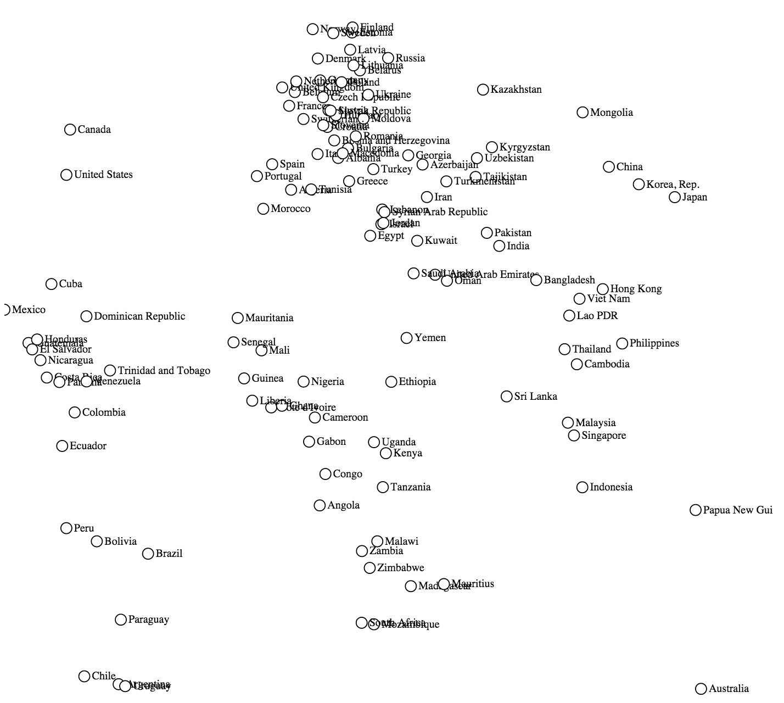
  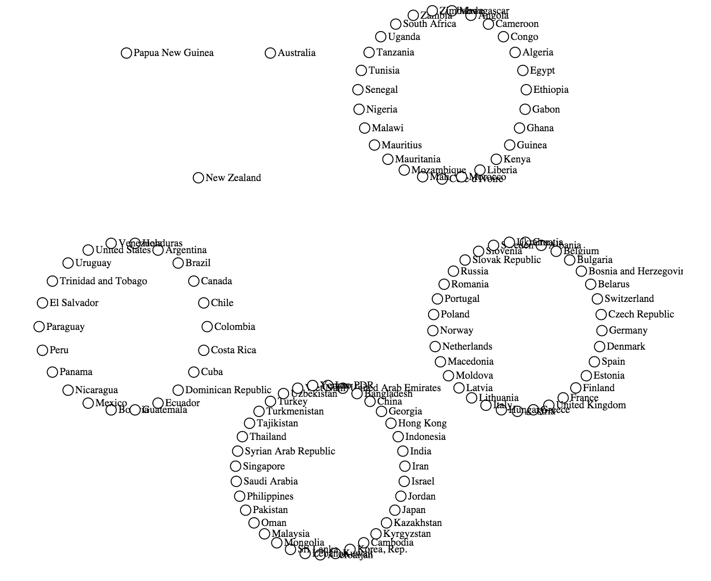
  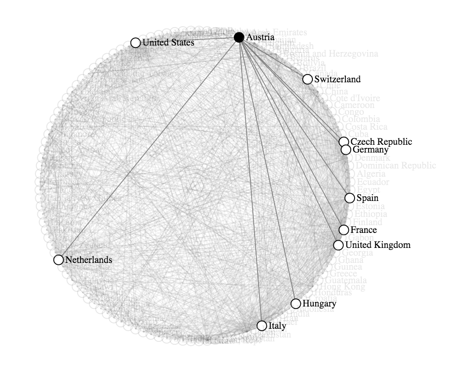
</p>

In contrast to Homework 1, which focused on implementation, in this homework we will primarily focus on designing visualizations. This homework is divided into two parts. First, you will learn to:

1. Create and use a [graph data structure](http://en.wikipedia.org/wiki/Graph_%28abstract_data_type%29), which is used very frequently in visualization.
2. Use different D3 layouts to display the graph's nodes.
3. Connect nodes and group them to prevent overlaps and improve readability.

The second part of this homework is your design studio implementation. We ask you to design and implement a visualization that effectively communicates the trade flows between countries from the dataset.

### Instructions

Answer the written questions in a file called [answers.md](answers.md). Precede each answer with the question number. Be concise and to the point, don't write overly long answers. Please use [markdown syntax](https://help.github.com/articles/markdown-basics/). Write your code for problems 1-3 in a file called [graph.html](graph.html).

For your design studio code, explain your design in a file [design.md](design.md), where you also include scans or photographs of your alternate designs, and write your code in a file called [design.html](design.html) (you may add more files if needed, but this file should be the main one to run your code). Put supplementary material (e.g., screen-shots, sketches, etc.) in an `/design/` folder.

## Getting Started

Look at the following [Gist](http://bl.ocks.org/romsson/48b0c815dfb79ede391c), which is also contained in the file [graph_example.html](graph_example.html)) that you can use as template for your implementation.

*Data-wise*, this code creates a graph with a fixed number of nodes and connections from a random dataset. It also creates random attributes for the graph nodes to end up with what is called a **multivariate** graph.

*Visualization-wise*, this code generates a visualization that encodes each node of the graph using one of the available [marks](https://en.wikipedia.org/wiki/Scalable_Vector_Graphics), a circle using SVG `<circle>` elements. It also draws lines (also a mark) between nodes using `<line>` elements. By default, it automatically organizes all elements on a 2D plane using the [D3 force layout](https://github.com/mbostock/d3/wiki/Force-Layout).

<p align="center">
  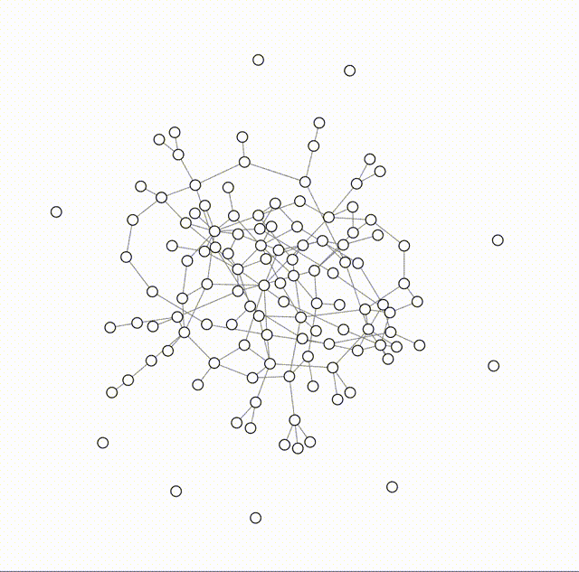
</p>

### Questions

The force layout used here is an example of a self-organizing graph layout: the nodes settle into a position determined by a physical simulation that considers nodes as a particles that repulse each other, while edges act as springs pulling them together.

**Question 0.1.** What is the meaning of the horizontal and vertical position of the nodes? Give examples of datasets particularly well suited to organize data this way.

The example contains the option to change the layout and graphical properties encoded (in this case, either 'Color' or 'Size'). Use your mouse to click on those options and observe the change.

**Question 0.2.** Which other channels (visual variables), beside color, size and position, could have been used? Name five.

**Question 0.3.** Are all the previously mentioned visual variables independent (e.g. if you change one, will it impact others?)? Give examples of graphical properties that are dependent (if any) and independent (if any) from each others.

**The remainder of this homework (except for the design studio) will focus on using the position of nodes (i.e., the position of the `<circle>` elements) to create meaningful visualizations.**  In other words, with the exception of labels using `<text>` and links between nodes using `<line>` or `<path>`, we will use no other marks or channels. **Another way to look at it is to think of designing a visualization that is only black and white, using circles and lines**. However, you are encouraged to use other marks and channels for your independent designs.

## 1. Simple Layouts

In this section, you will create charts where the position of a node encodes a quantitative value, using horizontal and vertical layouts. Technically speaking, you may only update the `x` and `y` attributes of the data, which will consequently update the coordinates of each data point (in the `graph_update()` function). We will ignore the connections between nodes for now.

### Rankings

Load the previous [countries dataset](data/countries_2012.json) for the year 2012 and create a graph where nodes are countries. Let's create rankings as in the previous homework. Your final layouts should resemble those shown here:

<p align="center">
  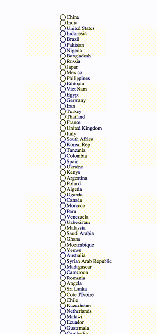
</p>

#### Implementation Tasks

Implement a layout to vertically align all data points (each point representing a country) based on the dataset's attributes. You can start with population.

* First, implement a representation that ranks the countries using equal vertical distance between all countries.

* Second, instead of spacing the nodes equally, plot the nodes on a linear scale, where the position is based on the population. Allow the user to switch between these two types of rankings.

* Show the countries' names using a `<text>` element. You may need to adjust the size of the main `<svg>` container to fit all countries.

* Add a drop-down box with all the keys that can be used as quantitative criterion to rank the countries by (e.g., GDP, population, etc.) with an `onchange` attribute to update the current layout with the newly selected dimension.

```html
<select>
  <option value="gdp">GDP</option>
  <option value="population" selected>Population</option>
  [..]  
</select>
```

**Question 1.1.** Discuss the pros and cons of the two types of rankings (either by relative or absolute position between nodes).

### Scatterplot

Let's create a [scatterplot](http://en.wikipedia.org/wiki/Scatter_plot), which is similar to the previous visualization, but uses two attributes to position a country item: one for the vertical axis, one for the horizontal axis.

<p align="center">
  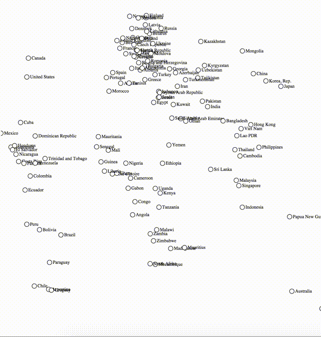
</p>

### Implementation Tasks

Create two scatterplots as follows:

* Use population and GDP as the two attributes.

* Use longitude and latitude as the two attributes.

* Allow the user to switch between these two scatterplots and animate the transitions.

### Questions

**Question 1.2.** Which data type (quantitative, ordinal, ..) is best displayed with scatterplots? Which one is not? Give examples.

## 2. Diving into D3 Layouts

So far, we have either created our own layouts (e.g., using scales) or used automatic ones (e.g., the force layout). One of the main advantages of D3 is that it provides more sophisticated layouts. A full listing of D3 layouts can be [found here](https://github.com/mbostock/d3/wiki/Layouts). We are now going to rely on these layouts to continue setting the countries' position in the SVG element.


### Circular Layout

A circular layout displays marks on a circle. See for instance the D3 [pie layout](https://github.com/mbostock/d3/wiki/Pie-Layout). However, it is not straightforward to understand how these layouts work, as they tend to do multiple things at the same time: creating the layout, updating the current dataset with the layout data, and creating SVG shapes to visualize the layout. Here is how the pie layout works using a very simple dataset (`data`):

```javascript
>var data = [1, 2, 3]
>var pie = d3.layout.pie();
>pie(data)
[▶ Object, ▶ Object, ▶ Object]
```

Look at one of the `Object`s that has just been created:

```json
pie(data)[0]
Object {data: 1, value: 1, startAngle: 5.235987755982988, endAngle: 6.283185307179585}
```

The `startAngle` and `endAngle` are new attributes that indicate the position of the data on a circle. This information then can be used in the creation of the pie wedges. The data can also be used to calculate the [centroid](https://github.com/mbostock/d3/wiki/SVG-Shapes#arc_centroid), which is defined as *the midpoint in polar coordinates of the inner and outer radius, and the start and end angle.* This provides, for instance, a convenient location for wedges labels. Below is the code to calculate the centroid for each wedge. Please note that you you have to define an `innerRadius` and `outerRadius` beforehand:

```json
pie(data).map(function(d, i) {
  d.innerRadius = r;
  d.outerRadius = r;
  d.centroid_x = arc.centroid(d)[0];
  d.centroid_y = arc.centroid(d)[1];
})
```
This centroid can be used for the position of points on the circle. Look at the [graph_example.html](graph_example.html)) for the complete code.

### Implementation Task

* Add an option to sort the points on a circular layout by population or GDP, using the [`.sort()`](https://github.com/mbostock/d3/wiki/Pie-Layout#sort) function.

### Questions

**Question 2.1.** What are the pros and cons of using a D3 layout? For example, why would we use the D3 pie layout when we could use a simple circle for layouting?

### Grouped Layout

In the previous examples, points were positioned based on a global function that equally applied to all of them. One way to add more information in layouts, such as a categorical data type like countries' continents, is by visually grouping them. The visualization shown below use the previous layouts (the force and circular layouts), but the countries were first grouped by continent.

### Implementation Task

* First, create horizontal groups, one for each continent, for the force layout. This is similar to this [multi-foci force layout](http://bl.ocks.org/DavidChouinard/fbd8889e8fbb5ffbabce) example, except that you will create an ordinal scale to layout the groups as in the figure below:

<p align="center">
  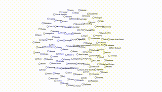
</p>

* Create a variation of the previous grouping by using the circular layout we previously introduced:

<p align="center">
  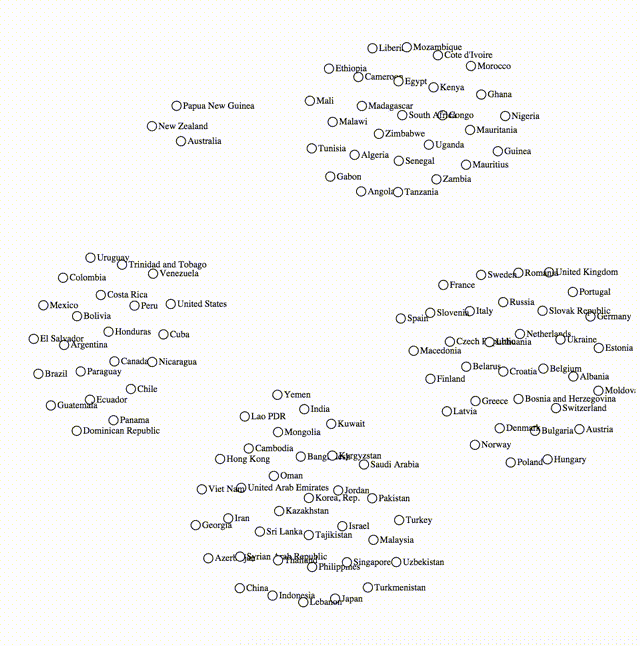
</p>

* Let's now apply the circular grouping twice: first to group countries by continent (like in the previous example), and then, instead of using the force layout, you are going to apply the circular layout for the nodes from the same continents:

<p align="center">
  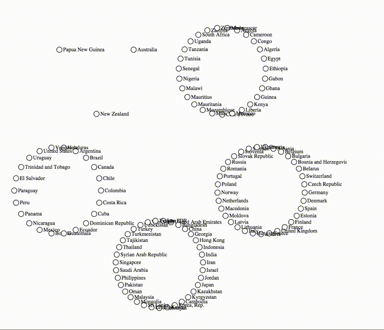
</p>

* For all representations/layouts, make sure transitions between the different representations are functional. Nodes and links should smoothly switch from one representation to another. Add the necessary UI elements (e.g., radio buttons, check boxes) to let the user activates those layouts.


## 3 Connecting Countries

Let's now activate the connections between countries. For this part, make sure you use the temporal dataset [data/countries_1995_2012.json](data/countries_1995_2012.json). In this dataset, we added a `top_partners` data object showing bilateral trade between countries. Here is a sample of the data:

```json
"top_partners":
	[{"total_export": 2036096161.9550002, "country_id": 223},
	{"total_export": 224173637.056, "country_id": 50},
	{"total_export": 158327929.5, "country_id": 16},
	[...]
	{"total_export": 61113059.0, "country_id": 37},
	{"total_export": 38838947.0, "country_id": 28}],
```

The `country_id` is the unique id provided for each country.

### Implementation Tasks

* Add links between countries using all the `top_partners`, for one year (pick you favorite year). You should see a result similar to this one:

<p align="center">
  
</p>

* As a way to reduce the visual complexity, emphasize links and connected nodes when the user hovers over a particular node. Thus, upon hovering over a country node, countries that are not connected to it should be displayed with a lower opacity.  [This example](http://bl.ocks.org/mbostock/7607999) behaves similarly.

### Questions

**Question 3.1.** Which other strategies can you think of to reduce the visual complexity? One example is edge bundling which we introduce in the following section. Enumerate up to three other strategies.

### Edge bundling (FYI, no implementation requested)

As you have probably noticed, loading all the top-10 connections between countries results in a complex graph (it contains 1,190 links, a "giant hairball" in vis lingo).

[Edge bundling](http://www.aviz.fr/wiki/uploads/Teaching2014/bundles_infovis.pdf) is a visualization technique that reduces the visual clutter of links in a graph. It routes similar links into groups or **bundles**. Below are illustrations of straight lines to connect nodes (left) and curved ones (right) using edge bundling.

<p align="center">
  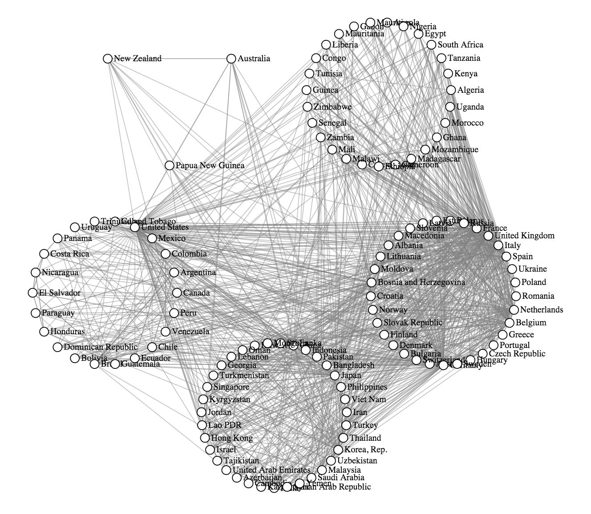
  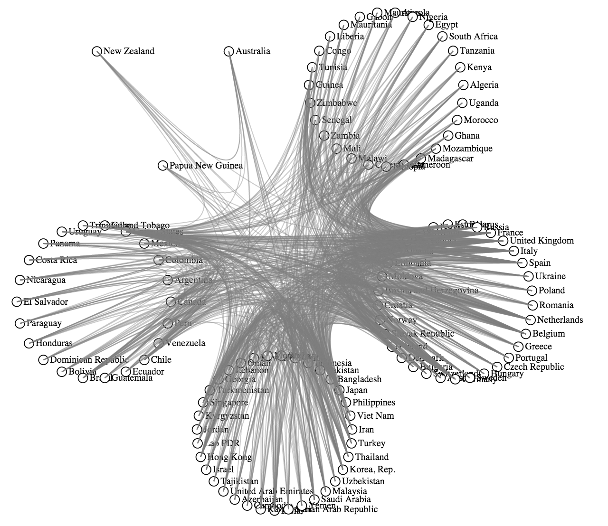
</p>

The [D3 bundle layout](https://github.com/mbostock/d3/wiki/Bundle-Layout) creates the links between nodes based using the `<path>` element. Look at [this example](http://bl.ocks.org/mbostock/7607999), and compare it to [traditional curved links](http://bl.ocks.org/mbostock/4600693).

## 4. Implement & Refine Design Studio Prototypes

In the design studio, held during lecture time, you will design visualizations that communicates who the main trade partners between countries are. You may leverage the wealth of information available for countries, like the volume of their trade and their change over time. Choose one of your designs, refine it if necessary, and implement it. You may be using the code you developed in this homework as building blocks for your visualization to save you time and to let you focus more on the design of layouts and connections.

You are now allowed to use other visual encodings (color, size, etc.) **but apply them carefully!**. Those additional parameters can either redundantly encode information that has already been encoded with position (e.g., color the countries by continent), or encode an attribute from the data that has not been conveyed by the position (e.g., volume of trade as thickness of link between countries).

This part of the homework is open-ended and gives you freedom in creating visualizations. You should employ the various concepts introduced in class and in the homeworks. For instance, interaction (e.g., time sliders or country filers) can help the user to focus on a specific subset of countries. Animation helps the user to understand what has been changed.

### 4.1. Bonus (extra 15%)
For outstanding implementations of the design studio prototypes, we will give out a bonus of up to 15%. 

