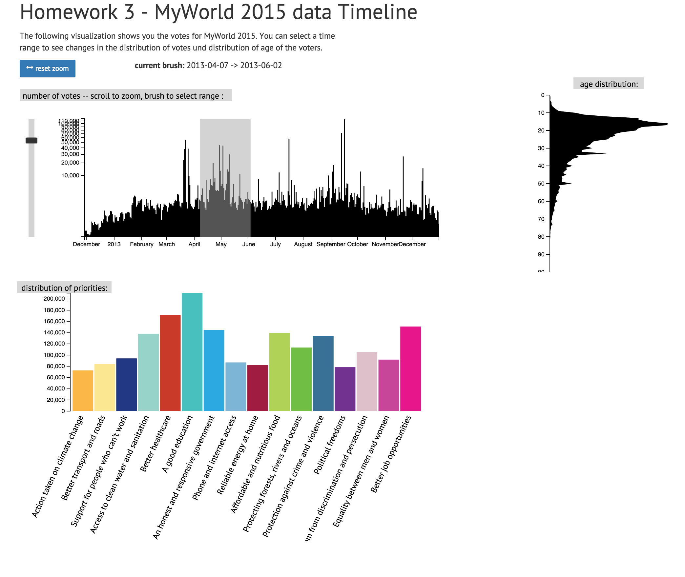
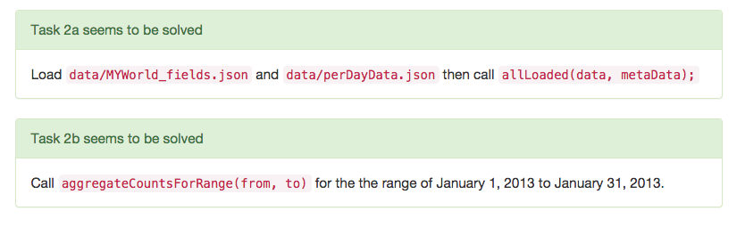
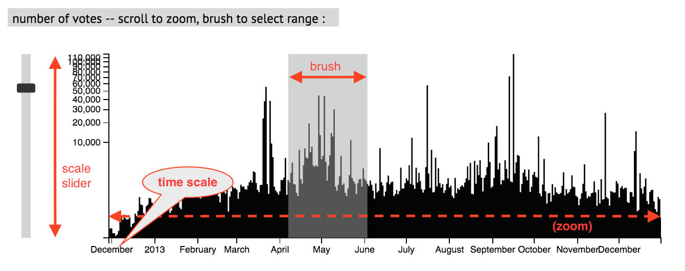
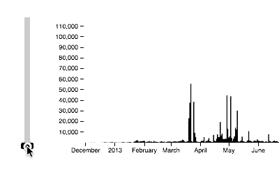
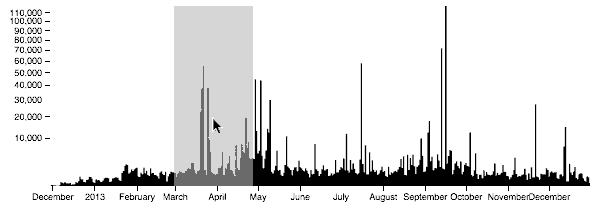
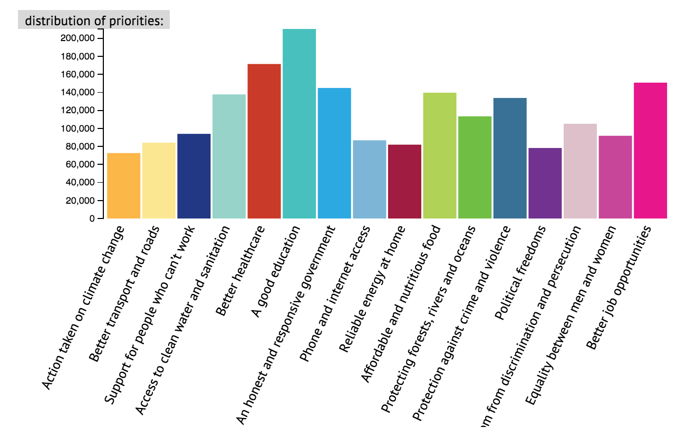
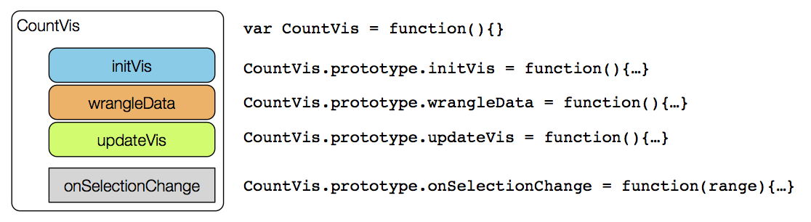
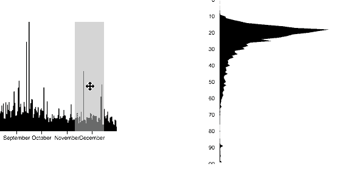
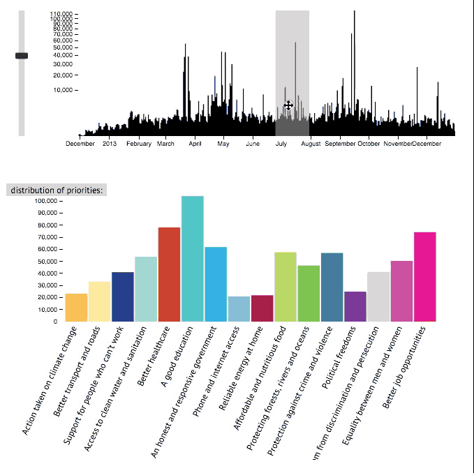

Homework 3
===
*This homework is due on Friday, March 27th 2015, 11:59 pm*

In this homework assignment you will create an interactive visualization using [D3.js](http://d3js.org). While the previous homework assignments were about iterating on a single visualization, the goal of this homework is to connect several pieces into an interactive multiple, coordinated views (MCV) system. You will implement some of the principles introduced in the ["Interaction" lecture](http://cm.dce.harvard.edu/2015/02/24028/L08/screen_H264MultipleHighLTH-16x9.shtml). 

For this assignment you will use data from the United Nations [MY World 2015](http://www.myworld2015.org/?page=about-my-world) vote project. MY World is a global survey commissioned by the UN Millennium  Project. It aims to capture people's opinions, priorities, and views on major issues, so that global leaders can be informed as they begin the process of defining the new development agenda for the world. Individuals are asked which six of sixteen possible issues they think would make the most difference to their lives. The sixteen issues are based on the priorities expressed by poor people in previous research and polling exercises. They cover the existing Millennium Development Goals and add issues of sustainability, security, governance and transparency. 
The data is collected using the [MY World webpage](http://www.myworld2015.org/), text messages, and printed surveys. 

You will build a system that allows interactive selection of time slices of the poll data from the years 2012 and 2013. For the selected time period, the visualization will show the amount of votes per priority/choice from the poll data in addition to a histogram of participant's age for the given selection. The image below and **[this YouTube video](http://youtu.be/Hlc4bGhgbKU)** show the (interactive) final product:
<p align="center">
    
</p>


After completing this homework you will be able to:

  - Select subsets of your data via brushing.
  - Show different facets of your data with multiple linked views.
  - Create an event handler to connect interacting parts of your project.
  - Integrate zooming into your visualizations (extra credit only).
  

To solve this assignment you should know about:

- the basics of D3js: selections (select, enter, exit), data driven attributes, transitions;
- ow to create scales and axis in D3;
- how to create an area chart and a bar chart in D3.


## 0. Feedback 
We would like to hear your feedback on Homework 2. Please fill out the [__feedback form__](https://docs.google.com/forms/d/1EuHa333YK5Y7calFMnrMNwsh6_5KwSZryB6misSDx9E/viewform).


## 1. Conceptual and Technical Background


This homework will bring you a step closer to implementing complex designs, such as your final project. In the following, we introduce several concepts and techniques that will make it easier to do this.

### Divide and Conquer

The homework splits a complex problem into smaller, easier-to-tackle sub-problems. Each sub-problem will be solved independently. 
The source you produce for the sub-tasks should then be integrated into the final system.

Problem 2 (Data Wrangling), for example, focuses on data handling as a subtask of the whole project. 
After you finished Problem 2 you should have two functions at hand:

1. a function for loading multiple files asynchronously,
2. a function for aggregating your data for a given time range.

You can then copy, paste, and adapt these functions to kick-start Problem 3. 
This methodology of splitting up your project into subtasks and testing subtasks (in their own independent files) individually will become very helpful for developing larger systems.

### Structure is Key

We provide you with a framework of how to organize a multiple coordinated view system and encourage you to stick with it for the assignment. This framework includes stubs for organizing individual visualizations into objects and a way to let them communicate with each other. Thinking about the structure of your project can save you a lot of time and make your implementation more robust, extensible and reusable. A simple structure as shown in the following figure can achieve that already. 

<p align="center">
    
</p>


A more detailed explanation of this structure and its application to the homework assignments is given in Sections 5 and 6.

### Files and Folders:

This homework comes with several files and folders that provide the framework and scaffolding for your implementation and includes many valuable comments on how to achieve the various tasks. The important files and folders are:

- **index.html**, the main file that coordinates all views. In here the individual visualizations are instantiated and linked via an Eventhandler.
- **/js** contains the files for the three visualizations.
- **/libs** contains external libraries (like D3, JQuery,..).
- **/data** contains the data files.
- **/css** contains the stylesheet files.

## 2. Loading and Wrangling Data

*This problem accounts for 10% of the points for homework 3.*

The original MY World data is described at [http://dataset.myworld2015.org](http://dataset.myworld2015.org). Please read the description carefully and get acquainted with the original data fields. We have already aggregated and transformed the data to make the data format a better fit to the tasks we want to perform. Here is an annotated sample from the file **perDayData.json**:

```javascript
  {
        "day": "2014-05-27",    // date in format: "YYYY-MM-DD"
        "count(*)": 1764,       // number of all votes for this day
        "sum(p0)": 91,          // number of votes for issues given Priority 1
        "sum(p1)": 185,         // number of votes for issues given Priority 2
        "sum(p2)": 171,
          ...
        "sum(p15)": 535,        // count of votes for issues given Priority 16
        "education": [          // counts for different education level
            {
                "education": 1,     // education level 1 (some primary) has..
                "count(*)": 33      // .. a count of 33
            },
            ...
            {
                "education": 4,     // education level 4 (finished secondary) has..
                "count(*)": 1013    // .. a count of 1013
            }
        ],
        "age": [                // counts for ages of participants
            {
                "age": 2,           // age 2 has..
                "count(*)": 3       // .. a count of 3 -- mhh ??
            },
            {
                "age": 3,           // age 3 has..
                "count(*)": 1       // .. a count of 1 -- really ??
            },
            ...
            ]
}
```

Some contextual information: 

- All data is aggregated **per day** (`"day"`) for all days in 2012 and 2013.
- The count of all votes on this day are stored in the field `"count(*)"` 
- The counts of all votes for priority 1 (`"sum(p0)"`) to priority 16 (`"sum(p15)"`) are accessible by the field names given in brackets. Mind the difference in indexing priorities  (priority **1** <=> p**0**).
- The daily sums of votes for different education levels of participants are stored in the array `"education"`. Each object in this array represents one education level (field `"education"`) and it's respective count (field `"count(*)"`)
- Equivalent to education levels, counts for each year of age are stored in the array `"age"`.

Make sure to unpack the file `data/perDayData.json.zip` as `data/perDayData.json`. You don't need to add and commit the unzipped file to your repository; this will keep the size of your repository smaller.


A second file (**MyWorld_fields.json**) contains meta-information about our data. For now, we are interested in the `"priorities"` object that gives us information for each priority. Again, the priorities are numbered from 0 (priority 1) to 15 (priority 16). You can easily access information for priority 6 via `priority["5"]`. 

Here is a sample:

```javascript
"priorities":{
      "15": {
        "item-color": "#E8168B",
        "item-title": "Better job opportunities",
        "item-content": "This means that governments ..."
      },
      "5": {
        "item-color": "#47C0BE",
        "item-title": "A good education",
        "item-content": "This means that all children should have ..."
      },
      ...
 }
```


The following information is given for each priority:

- The color of the priority on the survey webpage (`"item-color"`).
- A short name for the priority (`"item-title"`).
- A longer description of the priority (`"item-content"`).

### Implementation Tasks
These two tasks will help you in getting acquainted with loading more than one file at a time and in thinking about ways to aggregate values for a given time-range. The time-range will be dynamically defined by a user selection in the later tasks. 

To check whether your code delivers what is expected we included a simple test mechanism. You will find detailed instructions in the file [2_Tasks.html](2_Tasks.html). Implement tasks 2a and 2b in `2_Tasks.html` first, later you will integrate the code into your actual MCV system. 

*On a formal note: The tests are only there to help you. They are not relevant for grading.*

#### Task 2a: Asynchronous Data Loading

Load the json files **MyWorld_fields.json** and **perDayData.json** (remember, you will need to unzip the `perDayData.json` file first) and bind their content to objects  `metaData` and `allData`. Call the method `allLoaded(perDayData, metaData)` after **BOTH** files have been loaded. 

Hint: remember the asynchronous behavior of Javascript. A library called [d3-queue](https://github.com/mbostock/queue) will be helpful here. You find an very helpful example of how it is used [here](http://giscollective.org/d3-queue-js/).

#### Task 2b: Aggregation 
Implement the function `aggregateCountForRange(from, to)`. This function takes two dates as parameter - the start date and the end date of a date range. The function should aggregate the `count` values for the given time range.

Once you have completed task 2a and 2b, your [2_Tasks.html](2_Tasks.html) file should produce an output similar to what is shown below. 

<p align="center" style="font-size:10pt;">
    <br/>
</p>


## 3. Interactive Area Chart: Brushing & Zooming

*This problem accounts for 25% of the points for homework 3*

The data set contains the total count of votes for each day (`"count(*)"`). In this part of the assignment you will create a visualization that plots the number of votes per day using an area chart. A slider will allow non-linear scaling of the y-axis to reveal patterns that are lost using a linear scale. A user will be able to select a time range by brushing in the view. As a bonus task, you can make the visualization zoomable along the x-axis. The following image shows our final visualization:

<p align="center" style="font-size:10pt;">
    <br/>
</p>

Before starting, you should be know about the following:
 
- selections (refresh your knowledge [here](http://bost.ocks.org/mike/selection/) and [here](http://bl.ocks.org/mbostock/3808218))
- D3 scales and axes (refresh your knowledge [here](http://alignedleft.com/tutorials/d3/axes))
- D3 date functions might become handy (see [this](https://github.com/mbostock/d3/wiki/Time-Formatting))
- D3 path functions (see [this](http://www.d3noob.org/2013/01/filling-area-under-graph.html))

### Brushing in D3 

In D3, a brush is an interactive area where clicking and dragging of the mouse is interpreted as a selection of a range (in D3-lingo, this is called *extent*). The range selection can be used to make changes to the visualization. The extent of the selection is shown as illustrated in the following image. Note that the area where you can click and drag to initiate a brush is shown in blue, while the visible representation of the brush is shown in grey.

<p align="center">

</p>

You can create a brush with the code below. The brush takes a D3 scale as function for converting the range of a selection in the visualization space into a range of the data space. You should use the same scale for this brush as you used for drawing the axis and drawing your visual encoding. The `.on()` function takes a function as a parameter that is called when a brush event happens. Here a function called "brushed" is called each time the brush is used to select data:

```javascript
var visScale = d3.time.scale().domain([new Date("2014/12/3"), new Date("2014/12/12")]).range([0,500])
var brush = d3.svg.brush().x(visScale).on("brush", brushed);
```

A brush is added using the following command. 

```javascript
svg.append("g").attr("class", "brush").call(brush)
  .selectAll("rect").attr({
    height: bbVis.h
});
```

The `brush` function is called on a group element (`<g>`) and creates some DOM elements. Then, all the `<rect>` elements in this group are given a height. In order to understand what we are doing, let's have a look at the brush itself in the DOM tree. As described earlier, the brush consists of a mouse-sensitive area and a visual representation of the brushed area. To answer the questions below, we encourage you to implement a brush in a temporary file. (You don’t need to submit this file.)


#### Questions 
**Please answer in file ```answers.md```.**

Take a look at the elements that are added to the `<g>` element.

- **Question 3a:** Name the HTML element (type and class) that represents the interactive area.
- **Question 3b:** Name the HTML element (type and class) that is used for representing the brushed selection.
- **Question 3c:** What do the other DOM elements of brush represent? 


We want to use the brush to choose the data to show in our details-view. As mentioned before, whenever a brush is changed, the function `brushed` is called. In this function, we want to change the detail visualizations to only show the data for the selected time frame. 

### Tasks 

You should get acquainted with the [d3.svg.area()](https://github.com/mbostock/d3/wiki/SVG-Shapes#area) function and the d3 path functions. A useful guide can be found [here](http://www.d3noob.org/2013/01/filling-area-under-graph.html).

Before you start with the tasks of Problem 3, make sure to first copy and paste the functions you wrote for Problem 2 at the correct location into your code.

#### Task 3a: Create an Area Chart
Add your code to the `updateVis()` function in file ***js/countvis.js***.
Use the d3.svg.area() function to draw an area chart into the svg element.
Remember to normalize the x- and y-values to fit all values in your svg.  ([d3.scale](https://github.com/mbostock/d3/wiki/Scales) might be very helpful). Then add the axes (see [d3.svg.axis](https://github.com/mbostock/d3/wiki/SVG-Axes)).


#### Task 3b: Implement Brushing
Create a brush that reacts to mouse interactions on top of your created visualization. During brushing, a newly created function `brushed()` should be called.

Congratulations! You just created a visualization for the total number of votes per day and the users can select a time frame from your graph via brushing. Next we will introduce some (optional) advanced interaction techniques, and then add connected views.

#### Bonus Task 3c (extra 0.5 points): Non-linear scale deformation 

A linear mapping can be expressed as
<p align="center" style="font-size:10pt;">
<br/>
linear mapping of **data** values to **display** size
</p>
Mapping data onto a linear scale has the disadvantage that fluctuations of low values can be hard to see.
To address this problem, many visualizations use a non-linear scale. The most common non-linear scale is a logarithmic scale, where the original values are transformed by a logarithmic function. 
<p align="center" style="font-size:10pt;">
<br/>
logarithmic mapping of **data** values to **display** size
</p> 

See, for example, the [Semi-log plot](http://en.wikipedia.org/wiki/Semi-log_plot). 

This method has two drawbacks: the logarithmic function is usually not parameterizable, and the value of *log(0)* is infinite.

We will use a power scale ([d3 link](https://github.com/mbostock/d3/wiki/Quantitative-Scales#power-scales)) that transforms the data by taking it to the power of an exponent. 
<p align="center" style="font-size:10pt;">
<br/>
mapping of **data** values to **display** size with power scale. Parameter e is usually smaller than 1.
</p> 


The exponent is a parameter that can be adjusted, e.g., using a slider.

File **js/countvis.js** already includes a simple functioning slider created with the help of d3 dragging behavior (see function `addSlider()`). Whenever the slider is moved a function `sliderDragged()` is called. Your task is to convert the y scale of your area plot into a power scale that lifts the lower areas up when moving the slider upwards.
<p align="center" style="font-size:10pt;">
    <br/>
    **Figure 3c:** A slider controls the distortion of the y axis.
</p>

#### Bonus Taks 3d (extra 0.5 points): X-Axis Zoom 

The x axis in our visualization is very dense. Make it zoomable along the x axis  by mouse-scroll when the mouse curser is over the chart area. Make sure to update the brush accordingly. There is a trick needed to allow zooming and brushing on the same objects - if you’re stuck here, don’t waste too much time. <p align="center" style="font-size:10pt;">
    <br/>
    **Figure 3d:** Using the mouse-wheel to zoom in and out.
</p>


## 4. Reactive Detail Visualizations with Event Propagation 

*This problem accounts for 40% of the points for homework 3*

In this section you will add two visualizations that react to these brush selections:

- The first one shows the distribution of the age of the voters
 <p align="center"></p>

- The second one shows the distribution of votes for the 16 priorities: 
 <p align="center"></p>

Each visualizations will be an object that will follow the pattern we described before. See the example of how the vote-count visualization (CountVis) (['js/countvis.js'](js/countvis.js)) is conceptually constructed:

<p align="center">

    
</p> 

### Event Handler 

To connect the three views we will make use of an event handler. Instead of being directly connected with each other the views talk to each other via a mediator. A popular analogy of this principle is the Twitter service. For example, Homer follows (*binds* himself to) Bart. Once he has done that, Homer will be notified every time Bart tweets (```triggers``` a message event), Homer and all other followers get notified. However, Bart is only notified of Homer's tweets when he also explicitly subscribes to Homer. Applied to our visualizations that can be imagined as:

<p align="center">
    
</p> 

To implement the event handler we will use the [jQuery](http://jquery.com/) library. The library itself provides a lot of functionality and can be extended by plugins, But for this homework we will make use of only the **event handling** capabilities of jQuery, specifically these two functions:

- [`.bind(eventType, handler)`](http://api.jquery.com/bind/) - binds a function *handler* to an event *eventType*, with *handler* being a javascript function and *eventType* being a specific string, e.g., "bartTweeted".
- [`.trigger(eventType, extraParameters)`](http://api.jquery.com/trigger/) - triggers an event *eventType* and calls all functions that are bound to this event. Here, *eventType* is a string (see above) and *extraParameter* is an object representing extra data, like e.g., the number of donuts homer ate per type of donut: `{"message": "A BURP IS NOT AN ANSWER, DONUTS ARE!", "num_donuts"": "5", "timestamp": "Oct-10-2014, 10:00:12 PM GMT-5"}` 

These two functions can be used together to create a simple [event handler](http://www.clock.co.uk/blog/use-jquery-events-on-plain-javascript-objects). In this homework, an event should be generated whenever the brush selection changes in the count visualization. This event will be consumed by the event handler, which will subsequently call the ```onSelectionChange(startData, endDate)``` function for each of the registered visualizations (AgeVis, PrioVis).  

### Tasks

#### Task 4a: Prepare CountVis 
Create an event handler in ***index.html*** and trigger an event called '*selectionChanged*' during brushing (remember which function is called during a brush) in ***js/countvis.js***.

#### Task 4b: Create the Visualization for the Age Distribution
Create a vertical area chart that shows the distribution of respondents' ages in the current selection. Use the event handler and the aggregation function to integrate this visualization so that it adapts to changes in the brush selection. Bind the `onSelectionChange(startDate, endDate)` method to listen to the '*selectionChanged*' from the event handler in ***index.html***. Your result should look like this:

<p align="center" style="font-size:10pt;">
    <br/>
    <b>AgeVis</b> reacts to changes in brushing.
</p>

#### Task 4c: Create the Visualization class for Priorities Distribution (PrioVis)

Implement a bar chart that shows the frequency of selection of the 16 issues and place it below the vote count visualization. Color and label the priorities according to the metadata provided. For readability you could (not required) tilt the labels, as shown in the figure. To update the scale and the distribution of votes when the user selects a new time window you should bind the `onSelectionChange(startDate, endDate)` method to listen to the '*selectionChanged*' event. 

<p align="center" style="font-size:10pt;">
    <br/>
    <b>PrioVis</b> reacts to changes in brushing.
</p>

## 5. Design Studio: Comparative Visualization

*This problem accounts for 25% of the points of the assignment. You can get up to 0.5 bonus-point for stellar designs and implementations.*

The goal of this design studio is to develop/enhance the visualization to address the following task. 

In our visualization the data in the priority issue visualization and the age distribution visualization changes based on the selected time range. Whenever we change the selection (by brushing), the values and scales change. The number of changes that happen during brushing make it nearly impossible to track them all. To overcome this limitation (at least partially) you should create ideas to allow comparisons of values in the priority issue visualization. 
Lets assume that there are two ideas for comparisons: you could compare data of two selected time-intervals, or you could compare the selected data against overall averages.

 * Choose **one** comparison scenario and create at least three alternative designs that would allow this comparison. 
 * Implement one design in your visualization for the priority issues and explain why you have chosen this design.
 * Submit a screenshot of an interesting pattern which you have found with your method and briefly describe the pattern.

Complete [5_design.md](5_design.md) and submit your design iterations, your example and your comments as a PDF in the folder [designStudio/](/designStudio).


-- 

<p align="center" style="font-size:18pt;">
	
	<b>Once you completed all this, your new Expert Level is: </b>
    <br/>

</p>


